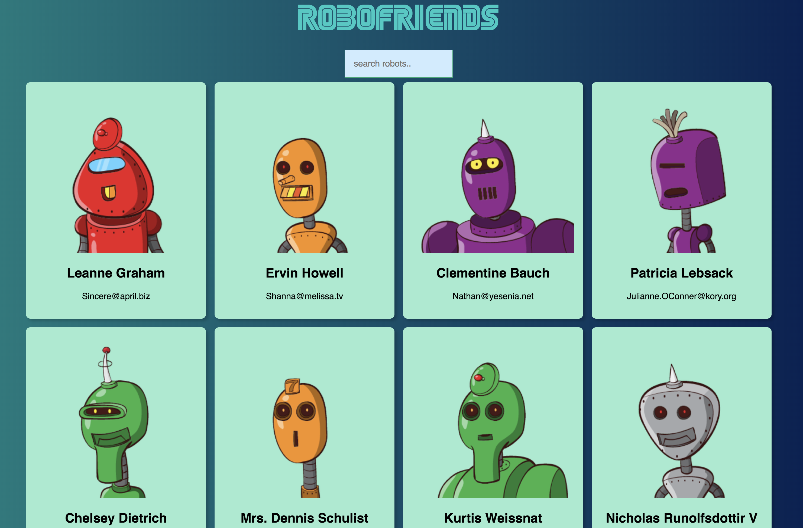

# My Robot Friends: An app that will randomly generate robot pictures.

Technologies used include React, Redux, HTML5/CSS3, Tachyons.

[See this app live!](https://lntellimed.github.io/robot-friends/)

